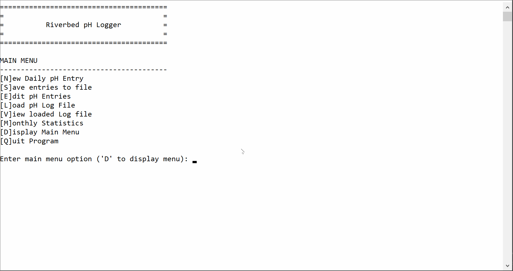

[](https://classroom.github.com/a/Wh-f4H-J)
# Assignment 03 - Methods, Arrays, and File I/O

Complete the assignment according to the specifications in ```CPSC1012 ASSIGNMENT 3 - Spring 2023 - Methods Arrays and File IO.pdf```

A demonstration of loading a data file (uses provided ```spring-2023-ph.csv``` test file) is provided below:


